### Student Challenge 3: Making a Chatbot for Facebook

#### Create a Chatbot that recommends products similar to an image and allows users to buy


Tip: Use this email service for temporary accounts

https://www.guerrillamail.com/


APIs to use:

- Flowxo (chatbot): (https://flowxo.com/)
- Cloudsight (api): (https://www.programmableweb.com/api/cloudsight)
- Shopstyle (api): (https://www.programmableweb.com/api/shopstyle)


Remember the 3 steps of api setup, applied to chatbots: 

1. Get api password (key and/or secret)
2. Learn to call api 
3. Connect API together (like pipes)


#### FlowXO: https://flowxo.com

**Creates Chatbots that can use API’s** 

- you can set chatbot rules, and what api services to use
- it creates bots that integrate with facebook, slack, many other third-party chat services 
	
Rules are called flows
	
Step 1: Create a Flow:

- Goto Flows > + New > Choose a Blank Flow Template:

  -  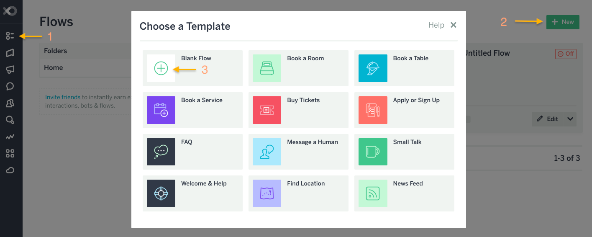
- Triggers decide when chatbot responds to a user
  - Choose the simplest: Catch-all - triggers on anything user types

    - 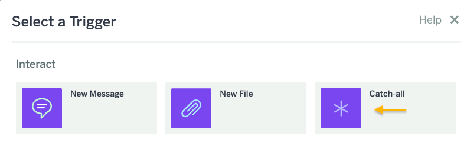
  - Test in console:

    - 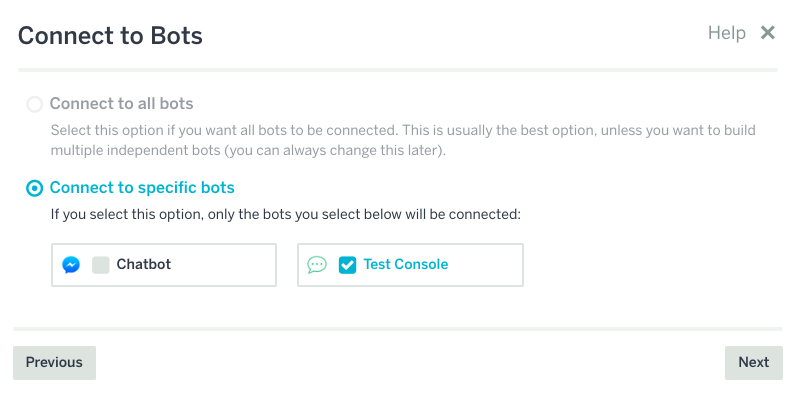
  - Add an action: Send Message
    - 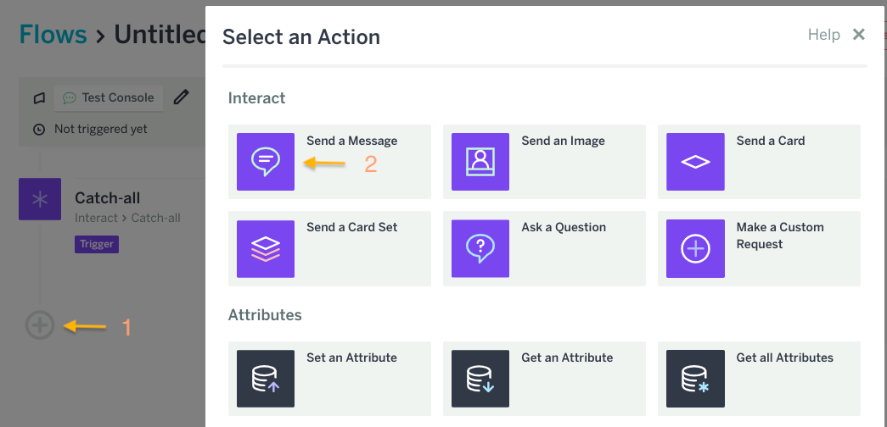
    - In Message, type: `{{catchall.message}}` 
    - 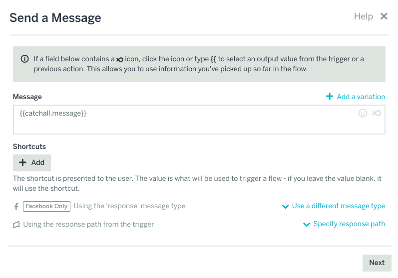
    - Press next, then next again to skip "Filter"
  - Give it go! Type something into the console and see it echo back!
    - 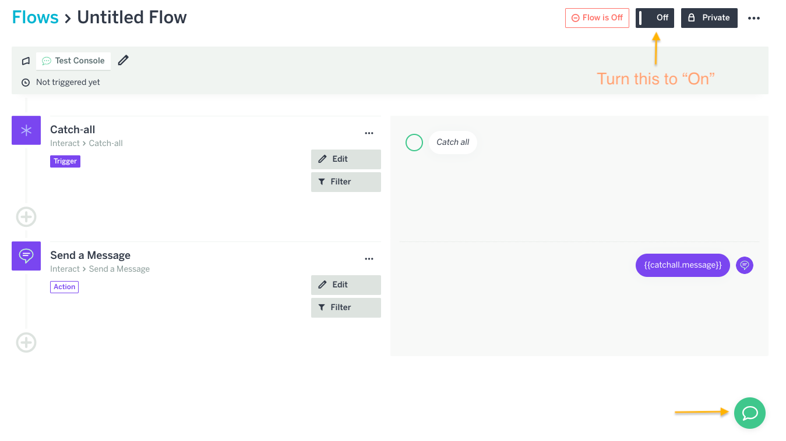
    - 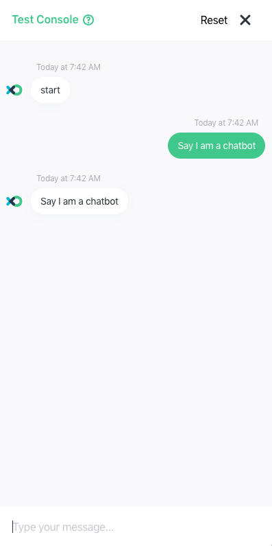
#### Cloudsight:
**Provides Image Recognition Service**
- Tags images with more details compared to other image recognition services
- More details allows us to better search for similar products

How does it work? 

- Checkout their website:  https://cloudsight.ai/

- Try recognizing this image:
  - 


Step 2: Sign up for a Cloudsight account

Step 3: Copy API Key 
- Left Navbar -> My Projects -> API Keys
- 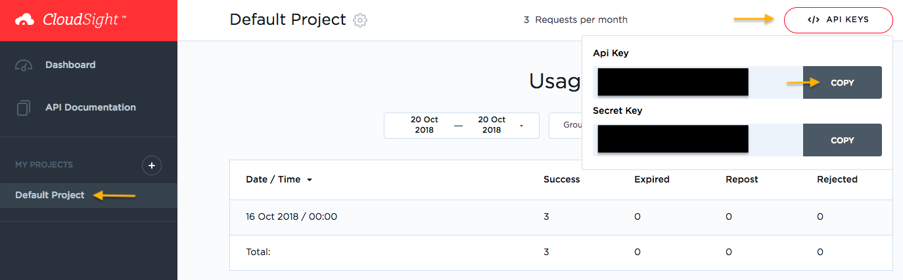

Step 4: Call API
- Open User guide: https://cloudsight.ai/docs
- 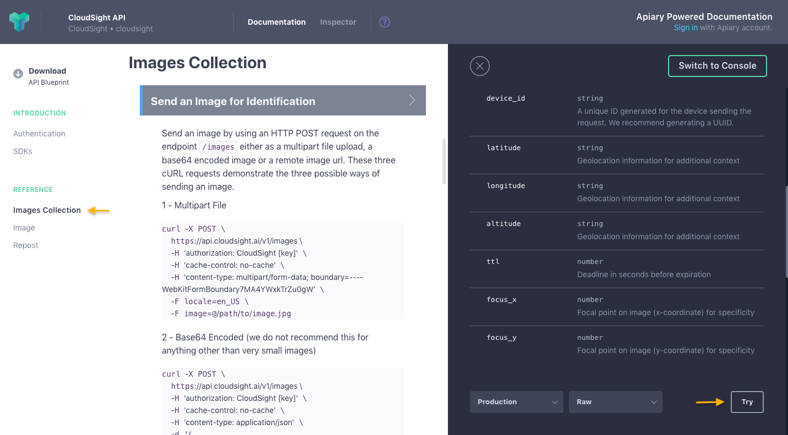
- POST https://api.cloudsight.ai/v1/images:
  - Put your API Key into Headers under `Authorization`: (Hint: Don't forget the `CloudSight` before it)
  - 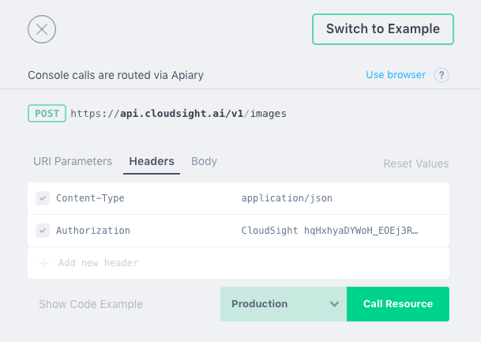
  - Put image URL into Body: `https://images-na.ssl-images-amazon.com/images/I/41AEG1Np0pL._SX342_.jpg`
    - 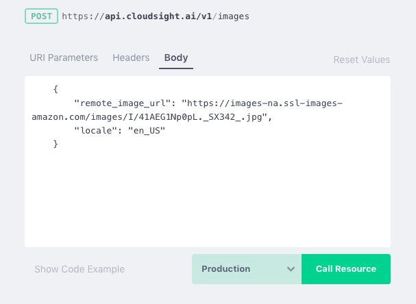
  - Click "Call Resource" and see the response:
    - 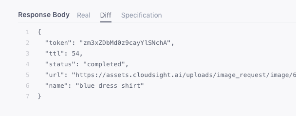
    - Result: JSON
	- meant to be what computers read, but humans can read too
  	- values are labeled like a dictionary
    	- In this result data - we want **the name that contains the description of the image**!

Step 5: Connect image recognition API with FlowXO:

- Add an action to the bottom of your flow
  - Choose: Make a HTTP Request
  - 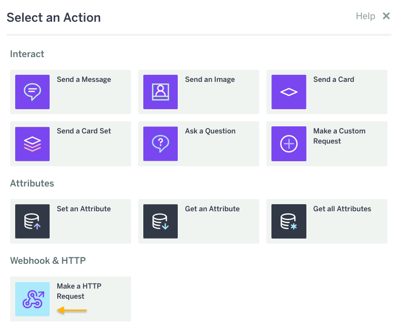
  - 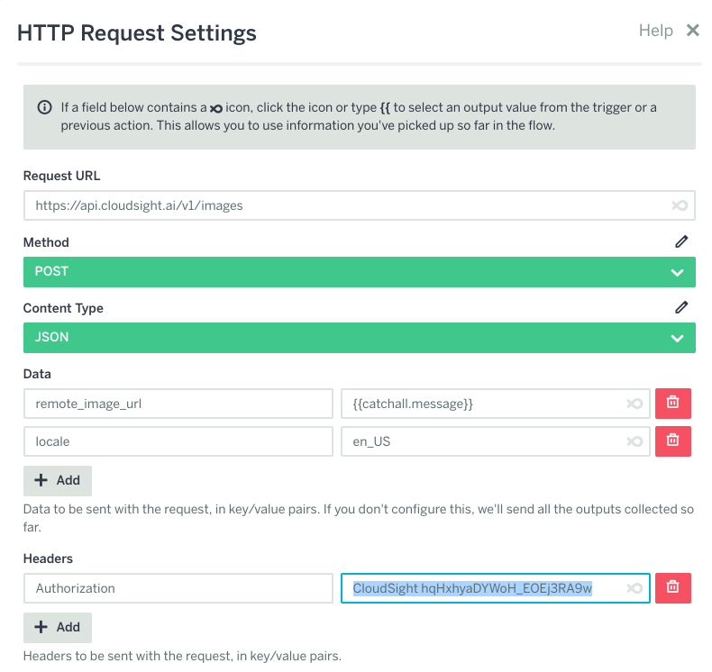
  - Put https://api.cloudsight.ai/v1/images in "Request URL"
  - Method: PUT
  - Content Type: JSON
  - Data: Add these values
    - remote_image_url: `{{catchall.message}}`
    - locale: `en_US`
  - Headers: Add
    - `Authorization: CloudSight [YOUR API KEY HERE]`
  - Click Next and Skip Filter 
- Add Send a Message Action to the bottom of your flow to show the recognized image tags 
  - Remeber the format of the API request result from the image recognition API in Step 4:
    		`"name": "blue dress shirt"`
  - FlowXO uses {{data__name}} specify the "name" label from an API request data
    - Hint: double underscore specifies a label in the result
  - In "Message", put: `Image contains: {{make_a_http_request.data__name}}`

#### Shopstyle
- Check out: 
  - https://www.programmableweb.com/api/shopstyle
  - https://www.shopstyle.com/
- They are a clothing catalogue site that exposes their data via API
   - Why? Affiliate marketing
      - they get more views on their products 
      - you get paid when user buys 

Step 7: Try using the API

It's simple to test: 

- Type into your web browser address bar:
  - `http://api.shopstyle.com/api/v2/products?pid=uid9924-40373882-64&fts=blue dress shirt`
  - try it by replacing `&fts=[A PRODUCT YOU WANT]`

Result:  

- 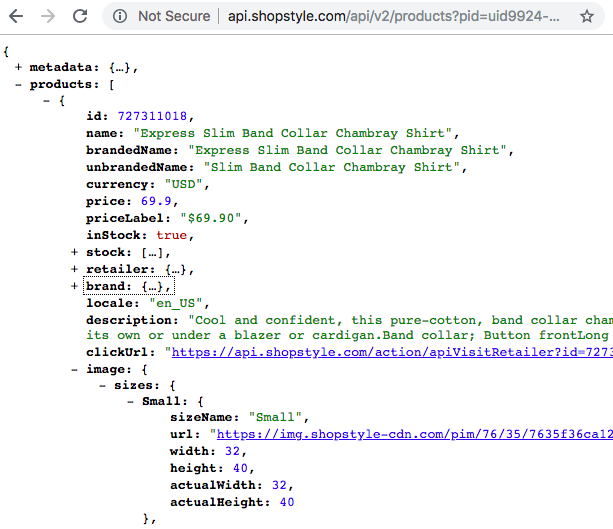
  - more complicated JSON
  - labels acting like folders - nesting inside each other
- In this result data - we want value of these nested labels:

```
products
	name
	description
	priceLabel
	image
		sizes
			Small/Medium/Large/IPhone/IPhoneSmall
				url
	clickUrl
```


Step 9: Connect shopping API with FlowXO:
- Create a new action at bottom: Make a HTTP Request 
  - 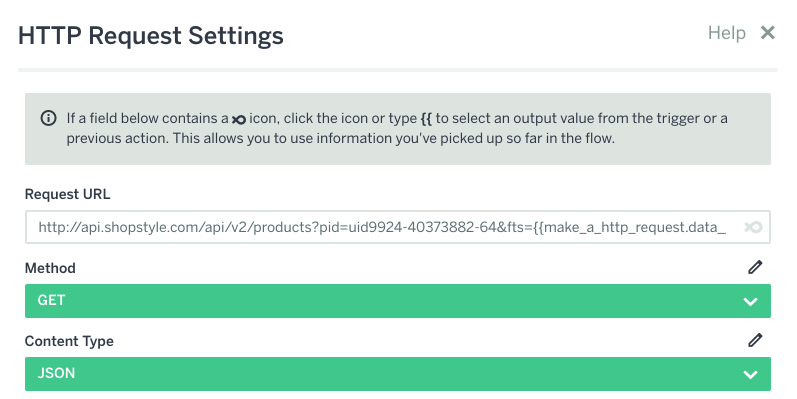
  - In Request URL: 
    - Put: `http://api.shopstyle.com/api/v2/products?pid=uid9924-40373882-64`
    - add &fts with tags from the image recognition result
      - &fts={{make_a_http_request.data__name}}
- Create Send a Card Flow
  - Respond with more than text - make it pretty:
- Create Send a Card Set Flow
  - Add a card with these values:
  - 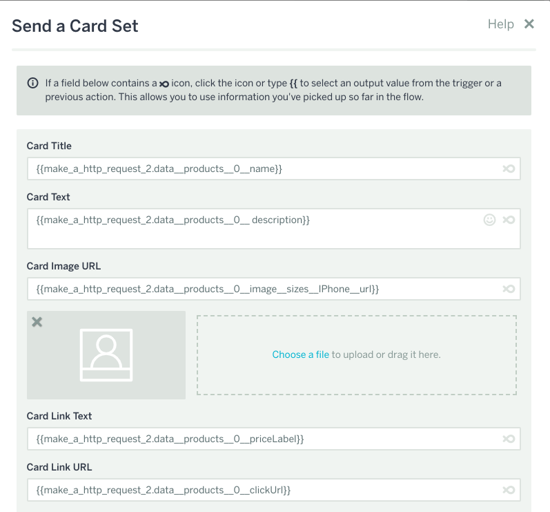
  - Card Title: `{{make_a_http_request_2.data__products__0__name}}`
  - Card Text: `{{make_a_http_request_2.data__products__0__ description}}`
  - Card Image URL: `{{make_a_http_request_2.data__products__0__image__sizes__IPhone__url}}`
  - Card Link Text: `{{make_a_http_request_2.data__products__0__priceLabel}}`
  - Card Link URL: `{{make_a_http_request_2.data__products__0__clickUrl}}`
  - Add a few more cards with the same values, but replace `__0__`  with `__1__` and then `__2__` to show the next products in the data returned by the shopping API

**You're Done! Congratulations!!!** - now you can test your ecommerce, product recommendation chatbot in your console!

Bonus (Homework): You can also make the chatbot live and connect to your Facebook page (belonging to a Facebook organization you can create)

